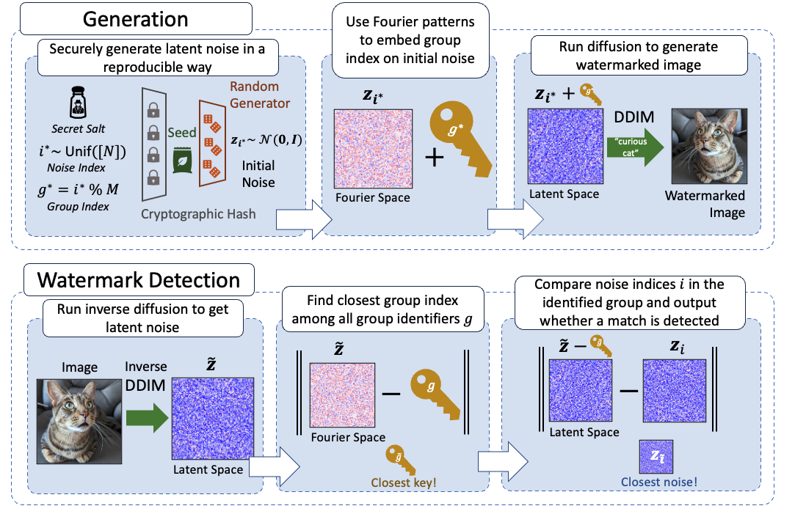

<div align="center">
  <h1>Hidden in the Noise: Two-Stage Robust Watermarking for Images</h1>
  
  
</div>

---

### About

We demonstrate that the initial noise used by the diffusion model to generate images can serve as a distortion-free watermark, but detecting it requires comparing with all previously used noises, and it remains vulnerable to certain removal attacks. To address these limitations, we propose a two-stage framework, **WIND**, that divides initial noises into groups and embeds group identifiers into them. For detection, we first retrieve the group and then identify the matching noise.

### Setup

To install the dependencies, run the `setup.sh` script:

```bash
chmod +x setup.sh
./setup.sh
```

### Usage

#### WIND Full

```python
python WIND_full.py --online
```

#### WIND Fast

```python
python WIND_fast.py --online
```

#### Other Experiments

Please check the `initial_noise` branch for the code related to other experiments discussed in the paper.
